# MMM Mediation Assessment

**Repository name suggestion:** `mmm-mediation-assessment`

Repository containing the `MMM_Mediation_Assessment.ipynb` notebook. This README embeds all plot images extracted from the notebook. 

## Contents

- `MMM_Mediation_Assessment.ipynb` — main notebook.
- `figures/` — extracted plot images used in the notebook.

## How to run

1. Open `MMM_Mediation_Assessment.ipynb` in Jupyter or Colab.
2. Run the notebook to reproduce results and regenerate plots.

## Figures

### Figure 1

**Caption:** Figure from cell 7, output 2

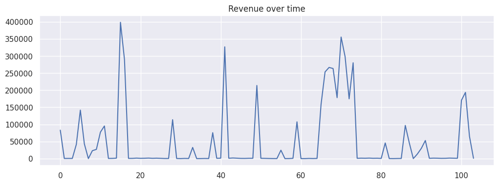

### Figure 2

**Caption:** Figure from cell 7, output 4

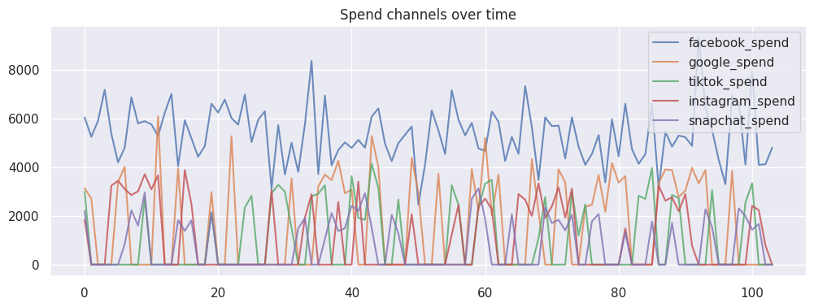

### Figure 3

**Caption:** Figure from cell 7, output 6


### Figure 4

**Caption:** Figure from cell 7, output 8

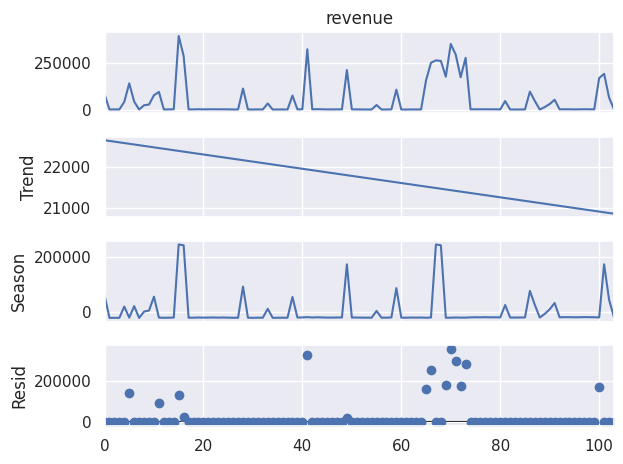

### Figure 5

**Caption:** Figure from cell 7, output 10


### Figure 6

**Caption:** Figure from cell 7, output 12

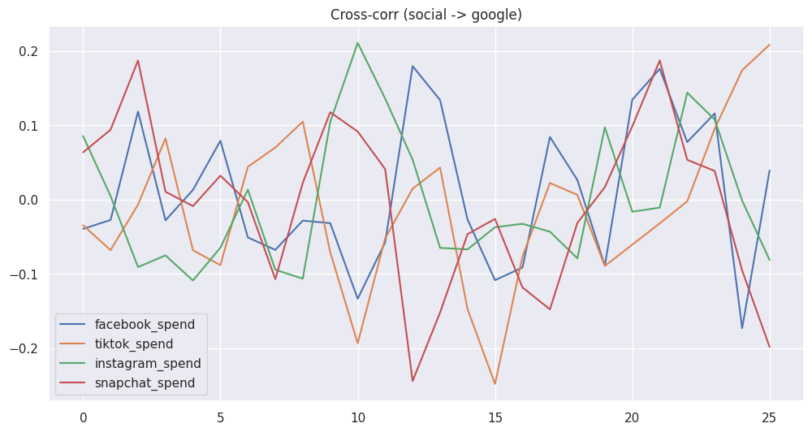

### Figure 7

**Caption:** Figure from cell 7, output 14

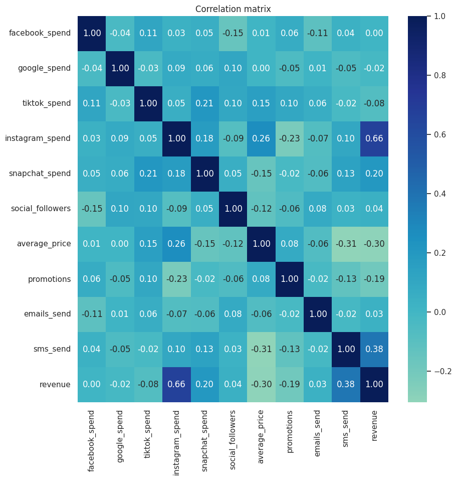

### Figure 8

**Caption:** Figure from cell 7, output 16

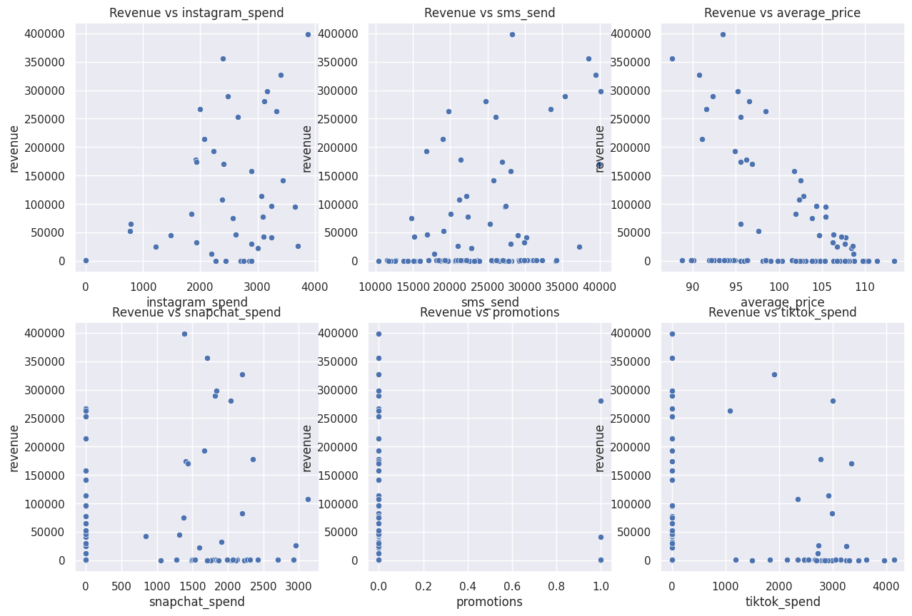

### Figure 9

**Caption:** Figure from cell 12, output 2

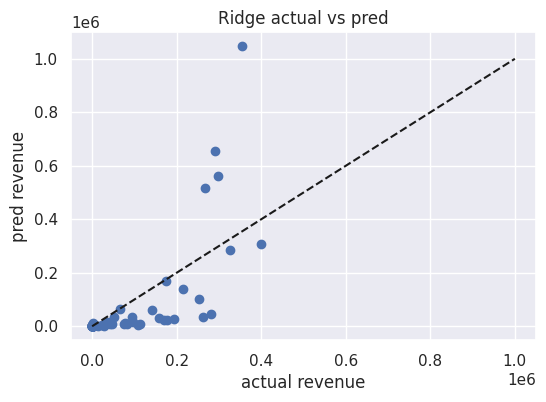

### Figure 10

**Caption:** Figure from cell 12, output 4


### Figure 11

**Caption:** Figure from cell 13, output 1

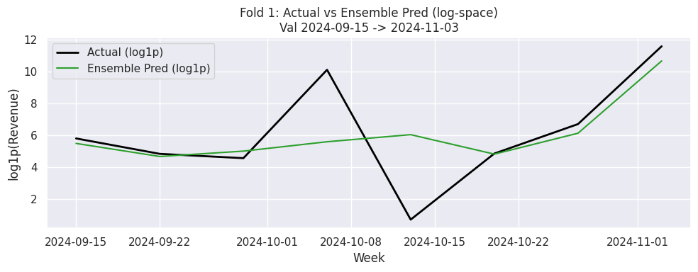

### Figure 12

**Caption:** Figure from cell 13, output 2

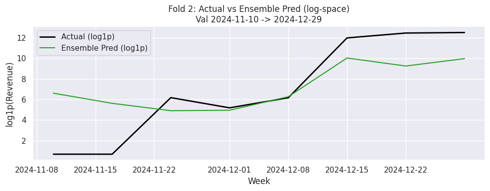

### Figure 13

**Caption:** Figure from cell 13, output 3

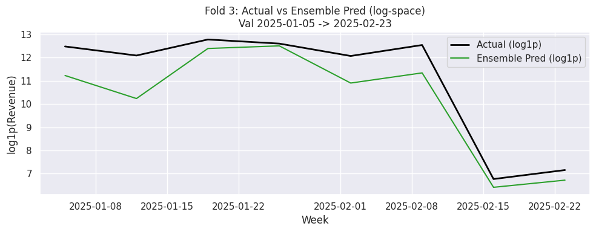

### Figure 14

**Caption:** Figure from cell 13, output 4

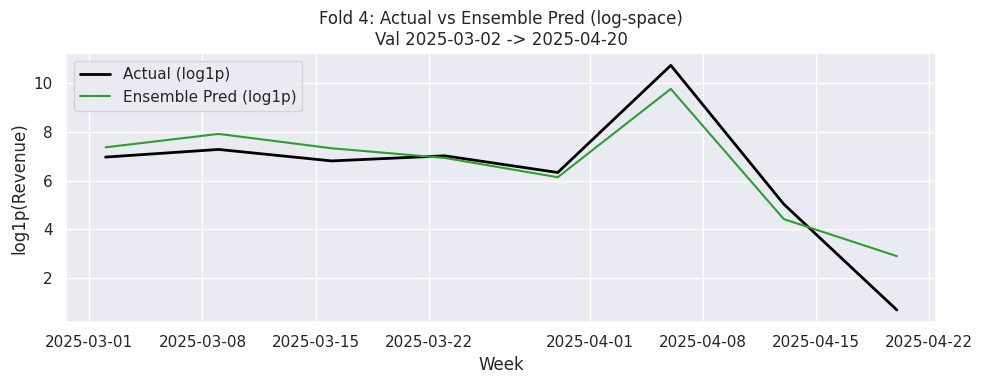

### Figure 15

**Caption:** Figure from cell 13, output 5

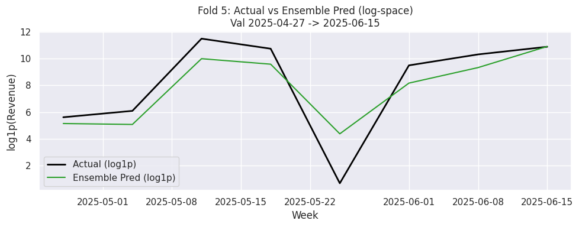

### Figure 16

**Caption:** Figure from cell 13, output 6

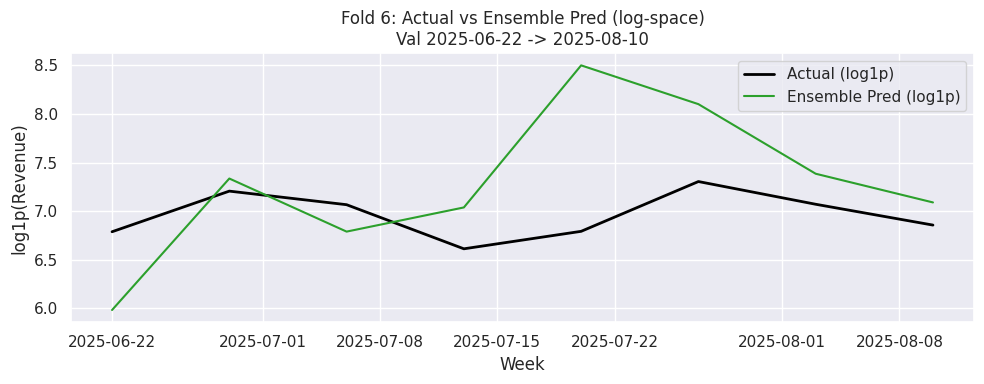

### Figure 17

**Caption:** Figure from cell 13, output 8

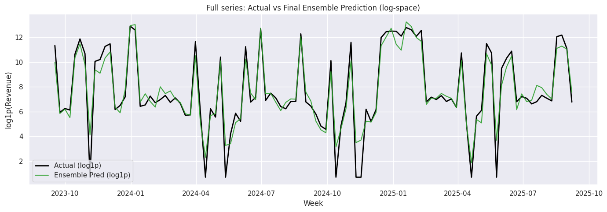

### Figure 18

**Caption:** Figure from cell 14, output 2

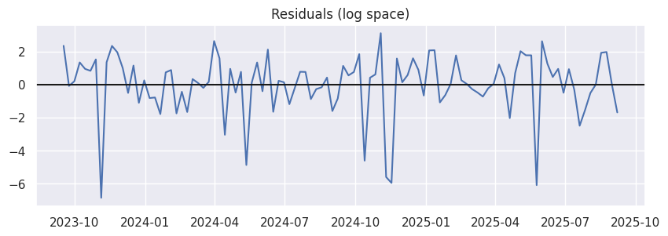

### Figure 19

**Caption:** Figure from cell 14, output 3

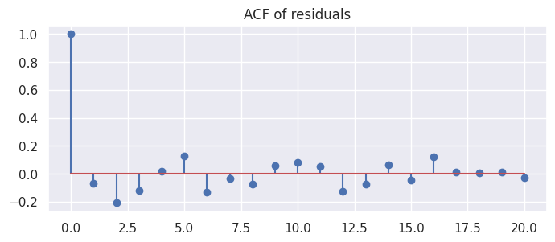

### Figure 20

**Caption:** Figure from cell 14, output 6

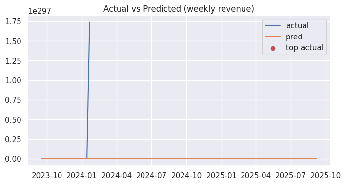

## Notes

- Figures were extracted automatically from the notebook outputs. If some plots are missing run the notebook and save outputs.
- To create the GitHub repo:

```bash
git init mmm-mediation-assessment
cp MMM_Mediation_Assessment.ipynb mmm-mediation-assessment/
cp -r figures mmm-mediation-assessment/
cd {repo_name}
git add .
git commit -m "Initial import: notebook and figures"
gh repo create --public --source=. --remote=origin --push
```

## License

Choose a license and add it to the repository if needed.