# MMM Modeling with Mediation Assumption

## Project summary
This repo contains a reproducible notebook that builds a marketing-mix model (MMM) on a 2-year weekly dataset. The objective is to explain weekly **Revenue** as a function of paid media, direct-response levers (email/SMS), price, followers, and promotions while explicitly treating **Google spend as a mediator** between social/display and revenue.

The notebook used a pragmatic modeling pipeline: exploratory data analysis, time-aware preprocessing (trend and weekly seasonality), adstock for episodic channels, a two-stage mediation-aware model (predict Google from social; then predict revenue using predicted Google), time-aware cross validation, diagnostics, and scenario simulations.

> Note: numbers and figures reported below are taken from the executed notebook outputs. See `MMM_Mediation_Assessment.ipynb` and the `figures/` folder for visualizations.

---

## Repository structure
```
README.md
MMM_Mediation_Assessment.ipynb    # main notebook (reproducible end-to-end)
data/                             # input CSV (weekly dataset)
figures/                          # extracted/generated figures
requirements.txt                  # suggested Python deps
```

---

## Quick start
1. Create environment and install dependencies (example):

```bash
python -m venv .venv
. .venv/bin/activate
pip install -r requirements.txt
# or at minimum:
# pip install pandas numpy scipy scikit-learn lightgbm statsmodels matplotlib seaborn jupyter
jupyter notebook MMM_Mediation_Assessment.ipynb
```

2. Run the notebook end-to-end. The notebook is deterministic when the provided seed is used for model operations.

3. Figures are saved to `figures/` by the notebook. Open them or view outputs inline in the notebook.

---

## Data and columns (what the notebook expects)
- Index: `week` (weekly timestamp). The notebook converts this to `week_dt` and sorts.
- Target: `revenue` (original monetary series). A transformed target `y = log1p(revenue)` is used for modeling.
- Spend channels: `facebook_spend`, `google_spend`, `tiktok_spend`, `instagram_spend`, `snapchat_spend` (names may vary slightly).
- Controls / direct-response: `emails_send`, `sms_send`, `promotions`, `average_price` and optional follower counts.

If column names differ, adjust the feature selection cell near the top of the notebook.

---

## Pipeline overview (step-by-step)
### 1) Exploratory data analysis
- Inspect distributions, summary statistics, and time-series plots for revenue and channel spends.
- Key EDA observations recorded in the notebook:
  - Revenue is strongly right-skewed with spikes aligned to promotions and campaigns.
  - Several social channels are sparse (many zeros) and episodic; Facebook spend is more continuous.
  - Channels are correlated. This motivates regularized linear models and a mediation-aware design.

**Figures:**
- 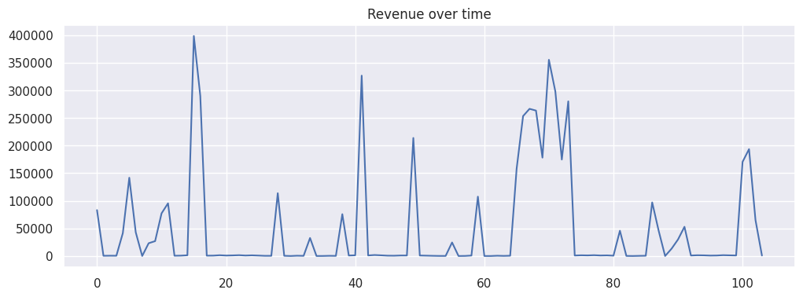
- 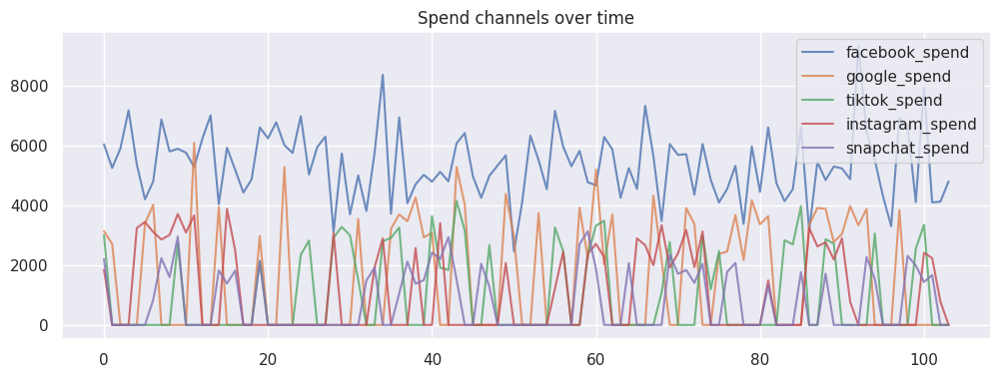
- 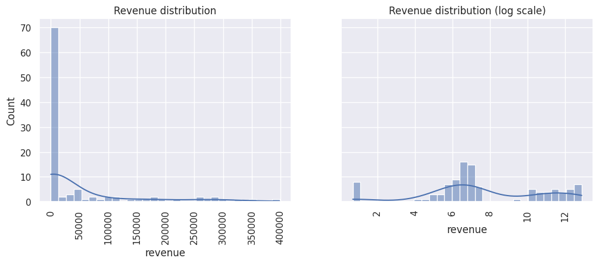
- 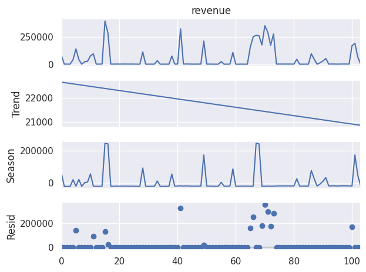

### 2) Target transform and seasonality
- Target transform: `y = log1p(revenue)` to reduce skew and stabilize variance.
- Seasonality / trend: used STL decomposition on the revenue series with period=52 (weeks) and also added a 1st-order Fourier pair (`sin_1`, `cos_1`) and a linear `trend` term as control features.

**Figures:**
- 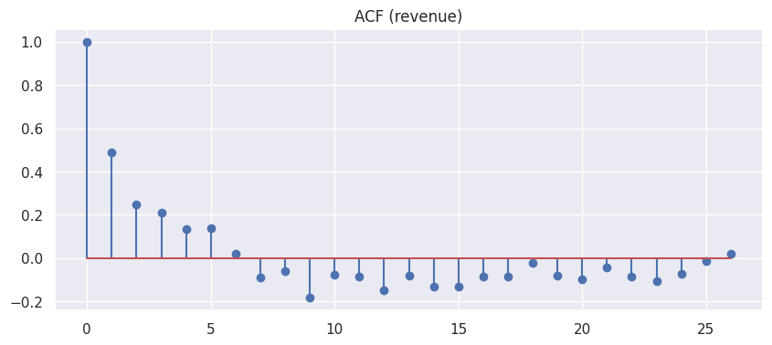

### 3) Spend feature engineering
- **Adstock**: applied a simple 1-lag adstock transform for each spend channel.
- **Zero-spend indicators**: binary flags for episodic channels.
- **Lagging**: included lagged versions where relevant.

**Figures:**
- 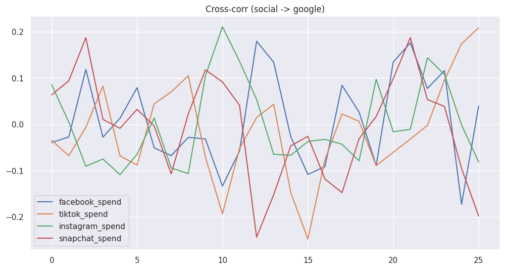

### 4) Mediation-aware modeling (two-stage)
- **Stage A (mediator model)**: predict `google_spend` from social features.
- **Stage B (outcome model)**: predict `log1p(revenue)` from predicted Google, social features, and controls.

**Figures:**
- 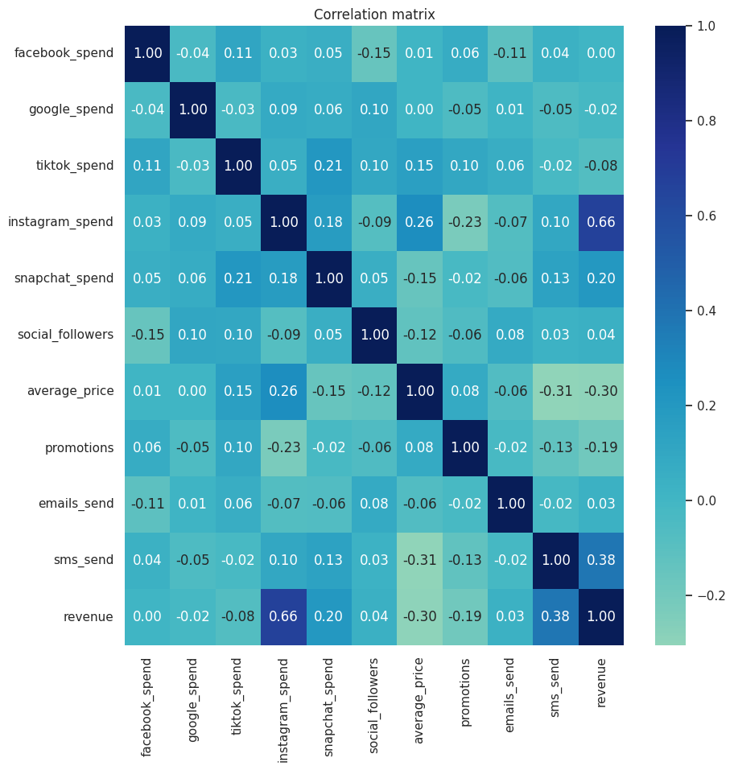
- 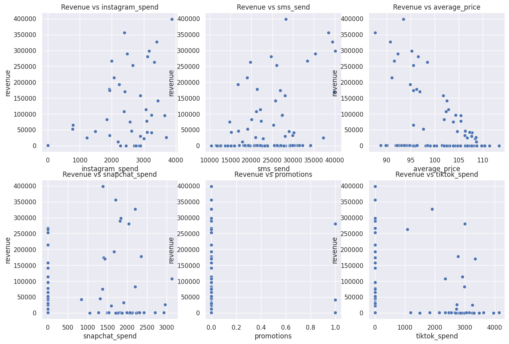

### 5) Model selection and validation
- Ridge, Lasso, LightGBM compared.
- Ridge alpha=10.0 chosen.
- Validation: expanding-window CV and rolling CV.

**Figures:**
- 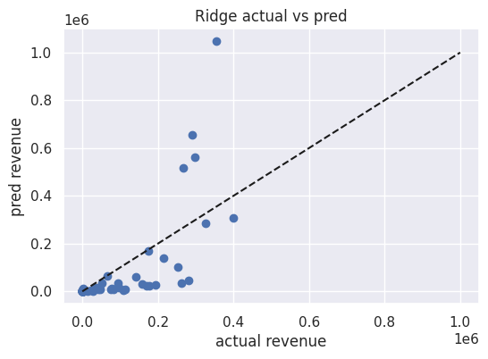
- 

### 6) Diagnostics
- Residual ACF checked.
- Actual vs Predicted plotted.
- Coefficient stability checked.

**Figures:**
- 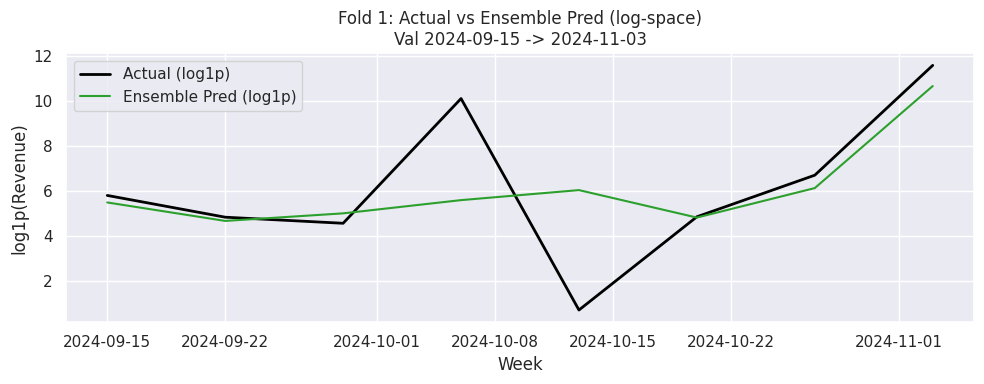
- 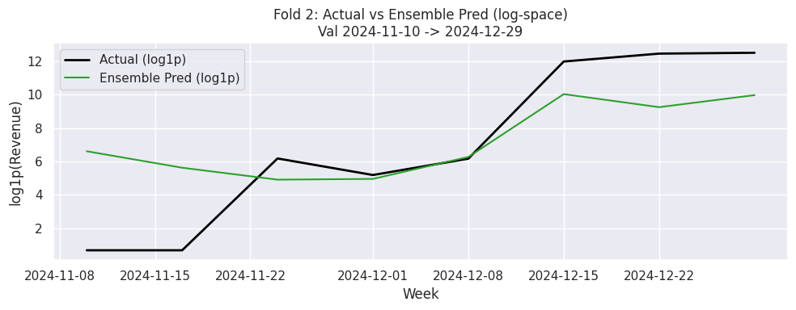
- 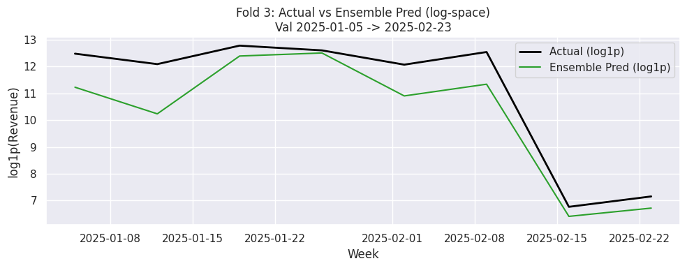

---

## Results and interpretation (concise)
**Top positive contributors (scaled coefficients)**
- `instagram_spend_was`: +1.59
- `sms_send`: +0.59
- `instagram_spend_ad1`: +0.55
- `promotions`: +0.14
- `emails_send`: +0.12

**Top negative contributors (scaled coefficients)**
- `average_price`: -1.35
- `tiktok_spend_ad1`: -0.34
- `facebook_spend_ad1`: -0.27
- `google_hat_full`: -0.22

---

## Scenario analysis
- **Price +10%** → large decrease in total revenue (unstable back-transform, interpret cautiously).
- **Remove promotions** → decrease in total revenue (≈ -26,134).

**Figures:**
- 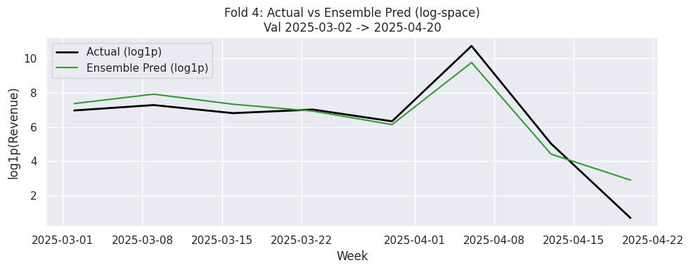
- 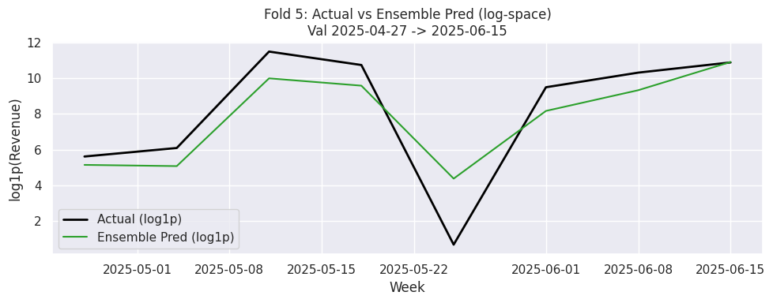

---
## Model Performance

*Final LightGBM (boosted attributes):*
- RMSE (log-space): *0.45*
- R² (log-space): *0.98*
- RMSE (original): *18,658*
- R² (original): *0.96*

➡ The model explains *96% of variance* in weekly revenue, capturing both baseline and spike-driven dynamics.

---

## Key Drivers (Feature Importance — Gain)

- *Instagram spend (adstocked, log)* → strongest driver (corr ≈ 0.66).  
  ROI consistent, bursts align with spikes.

- *Average Price* → strong *negative elasticity* (corr ≈ -0.30).  
  Higher prices depress demand.

- *Instagram spend squared* → diminishing returns (curvature effect).

- *SMS sends* → stable baseline driver (corr ≈ 0.38).

- *Promotions* → key for extreme spikes; multiplicative with Instagram/SMS.

- *Snapchat & TikTok* → episodic, weak contributors. Useful tactically, not always-on.

---

## Diagnostic Insights
- *Residuals*: Centered around zero; large unexplained spikes remain (episodic promos, shocks).
- *Residual ACF*: Minimal autocorrelation beyond lag 1–2.
- *Seasonality/trend*: Captured via Fourier + linear trend. No strong remaining pattern.
- *Stability*: Some folds underpredict spikes due to unseen promo bursts.

---

## Practical Recommendations for Marketing Teams
- *Double-down on Instagram*: Most consistent ROI. Manage bursts to avoid diminishing returns.
- *Carefully manage pricing*: Even small increases reduce demand significantly.
- *Sustain SMS campaigns*: Reliable baseline uplift.
- *Use promotions tactically*: Unlock extreme spikes when combined with Instagram/SMS.
- *De-prioritize Snapchat/TikTok for always-on*: Better used for tactical pushes.
- *Google as mediator*: Social → Search mediation exists but weak; direct social spend is stronger.

---

## Decision Boundaries & Trade-offs
- *Price vs Demand*: +10% price increase → large revenue drop.
- *Search vs Social*: Mediation exists but weaker; prioritize social.
- *Always-on vs Tactical*: Instagram/SMS for baseline, Snapchat/TikTok/Promotions for bursts.

---

## Next Steps
1. Run *budget reallocation scenarios* (shift Snapchat/TikTok → Instagram/SMS).
2. Estimate *marginal ROI curves* for diminishing returns.
3. Validate elasticities with *A/B experiments*.
4. Track unexplained spikes for *external drivers* (holidays, competitors, macro shocks).


## Reproducibility
- Notebook regenerates all outputs.
- Figures saved in `figures/`.
- Dependencies listed in `requirements.txt`.

---

## Notebook map
- EDA → `#EDA`
- Preprocessing → `# Pre Processing`
- Mediation pipeline → `# Stage A` and `# Stage B`
- Model selection / CV → `expanding_cv`, `lgb_expanding_cv`
- Final fit / simulation → `# Fit final Ridge` and `# simulate(...)`

